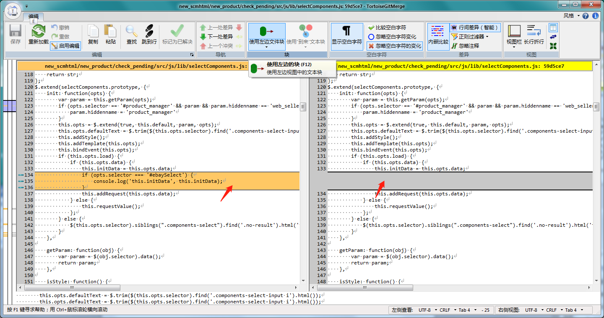
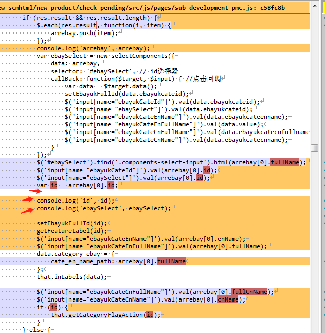
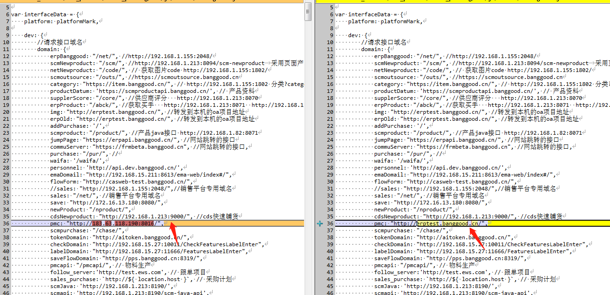
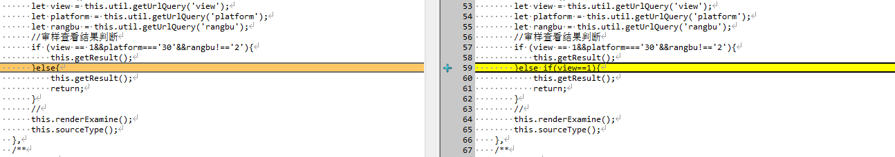
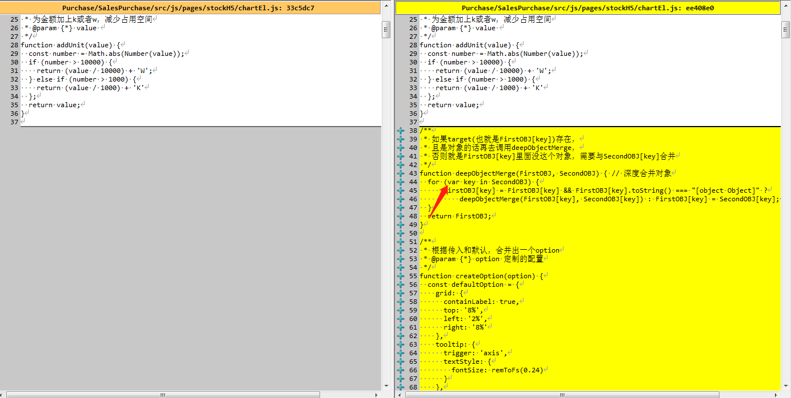
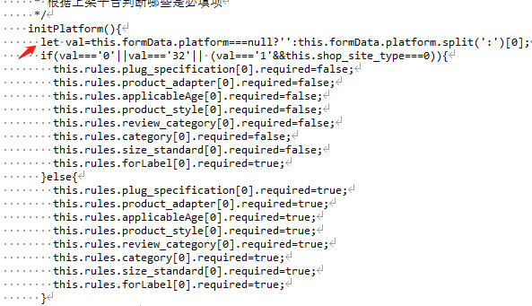
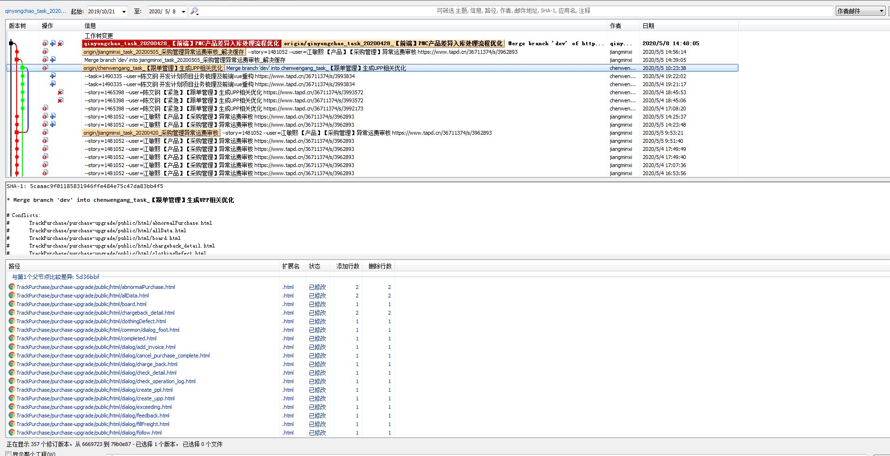

# 2020-05-08期代码走查
---
本次代码走查带来的思考和预期
1. 在代码走查的过程中，发现取值，参数的问题一定要判断数据类型，Null和undefined
2. 代码逻辑，批量调接口的时候一定要考虑好性能优化，在较为合理的基础上再去实现业务
3. 在开启代码逻辑前尽量做好全局思考   
**后续展望：**   
a. 寻找到能够自动化代码走查的工具  
b. 针对已经存在的代码问题，是否能寻找出比较合理的解决方案或者是解决的工具，避免重复出现，而不是手动改正

**开发计划模块** 

1.没有任何作用的方法和判断请删除
```js
// 没有任何作用的方法和判断请删除
```
  
2.去除多余的console语句，变量命名禁止用var
```js
// 不符合新的变量命名规范（不变const.其他let）
```
    
3.本地开发要走代理，不要直接掉ip地址，若有修改，提交的时候请还原回来
```js
// 不符合gulp配置规范,走域名拿到当前cookie,暴露问题
```
    


4.判断语句要用全等，判断数据类型，增加代码的严谨性
 ```js
// 不符合判断规范
```
     
**采购模块**  
5.For循环请使用let语句，调整指针指向

```js
// 不符合变量命名规范
```
     
 
**EMA模块**  
6.对于数据类型可能为null的数据，在做数组行为的时候，比如split,join等时，一定要做数据类型的判断
```js
// 不符合数据类型规范
```
  
**仓储模块**  
7.Public目录一定要忽略，不然进行代码走查，找不到修改的文件
```js
// 不符合代码提交规范
```
  

