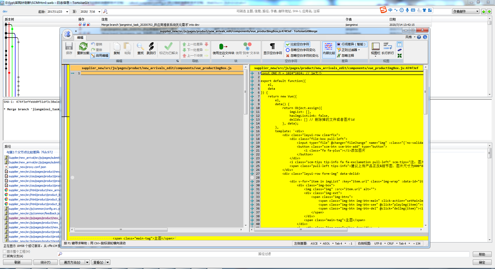
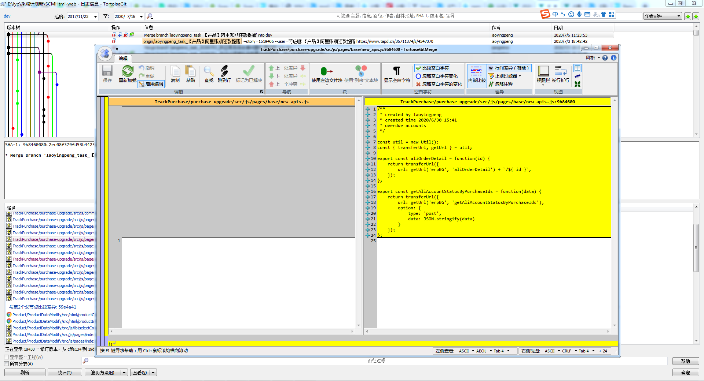
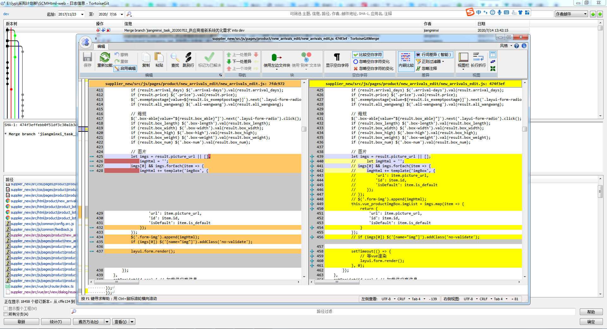
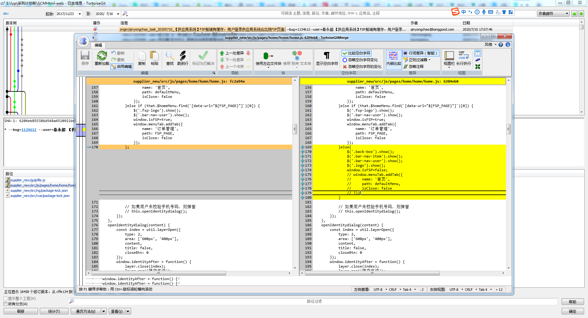
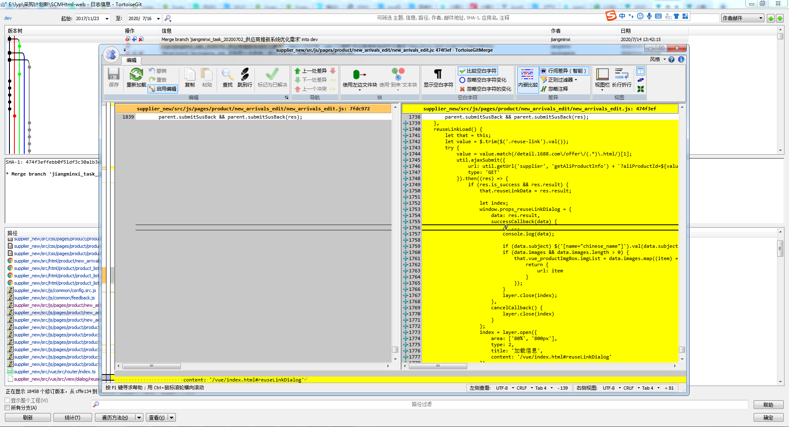
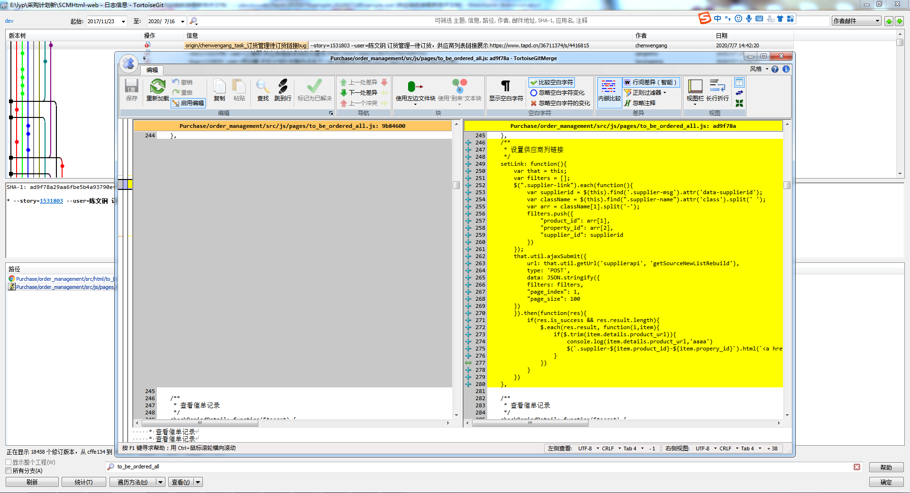

# 2020-07-18期代码走查
---
1.独立的模块需要有注释说明



2.注释的代码如果以后可能会复用的话，请用TODO标明，否则必须要删除。避免使用过多重复的行内样式，用类名替代。



3.上线前应该去除console


4.命名规范，变量声明需提前，须采用es6规范（let const）


**建议与展望**

1.方法的注释尽量用多行注释，并且注释位置在方法开头
```js
/**
 * 两数相加
 * @param n
 * @param m
 */
function add(n, m) {
    return n + m
}
```

2.尽量使用解构的形式来获取对象|数组中的值
```js
const { supplier_id, supplier_name } = supplier || {};

const [default_id] = purchase_id_list || [];
```
3.尽量使用箭头函数
