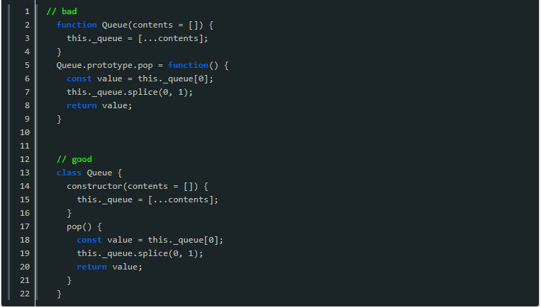

# 框架篇（vue、angular）
---

::: tip 提示
基本原则：遵循前端工厂化开发模式，组件化、模块化、抽象化
:::

1. 组件声明须用语义化的英文来命名（驼峰命名法）
2. 路由嵌套不能多于三层
3. 接口须统一在单独的`js`文件内封装注册，外部域名须统一封装处理
4. `vue-store`，`ng-store`需根据项目大小决定引入与否，（建议较大项目引	 入），小项目或单个页面采用传值即可
5. 异步函数采用`async` `await`的实现方式来代替`promise`
6. 统一推荐使用箭头函数，展示式运算符
7. 字符串拼接必须使用`${}`，`html`拼接必须使用反引号``简化操作
8. `default`函数参数设置默认值，单独的`js`文件须有`export`
9. 组件的封装要尽量降低与其他组件的耦合性
10. 所有的组件必须按照一个固定的结构，导出一个清晰、组织有序的组件，使得代码易于阅读和理解。同时也便于标准化`（name,data,props,components,filters,mounted,watch,methods）`
11. 谨慎使用`$refs`，`$parent`等查找元素的方法（组件必须是独立的，如果一个组件的API不能够提供所需要的功能，那么这个组件在设计、实现上是有问题的）
12. 推荐安装vue devtools进行调试开发
13. 建议提供组件API文档，类似如下的效果，可以更新在REDME.md文件中	（效果如下）


14. 必须使用class语法，避免直接操作prototype属性



## JQ旧项目(Vue)
---

::: tip
基本原则：当前维护的项目大部分以Jquery搭建，考虑项目的开发效率，日后重构的便利性，和组件库生态的互通。需要尽量使用Vue去维护旧项目。
:::

### 一、新需求，新页面（弹窗）

通过在旧项目使用iframe，把Vue项目链接嵌入。其中JQ页面和Vue页面iframe之间**通讯规范**：

JQ页：在window下挂载对象，**命名以"props_"开头 + vue页面命名**

**parent.html(JQ)**:
```

window.props_son = {
    form: {
        input: '',
        select: ''
    },
    successCallback: () => {

    },
    errorCallback: () => {

    }
}
```

**son.vue(Vue)**:
```
<template>
    <div>
        <input v-model="props.form.input" />
        <select v-model="props.form.select"></select>
    </div>
<tamplate>

export default {
    data() {
        return {
            props: window.parent.props_son
        }
    },
    methods: {
        success() {
            this.props.successCallback();
        },
        error() {
            this.props.errorCallback();
        }
    }
}

```

### 二、新需求，旧页面

旧页面使用**Jquery和Vue共存**的方式，处理新的需求迭代，但并非都适合，面对需求，建议从三个方向考虑：

- Vue实例代码和旧页面js解耦，不在同一份js中同时使用Vue和Jquery
- 在旧页面中使用Vue，不会加重原有代码的维护难度，不会影响开发效率
- 增加的Vue代码部分，日后重构能大部分直接复用

如果满足这三个要求，才可以使用Vue。如不满足建议采用原有方式实现

JQ和Vue共存**规范**：

vue资源引入使用cdn链接：

```
<link rel="stylesheet" href="https://content.banggood.cn/Scripts/element-2.13.0/theme-chalk/index.css"/>
<script type="text/javascript" src="https://content.banggood.cn/Scripts/vue-2.5.17/vue.min.js"></script>
<script type="text/javascript" src="https://content.banggood.cn/Scripts/element-2.13.0/index.js"></script>
```

- 原有html中新建一个**节点**用于挂载vue实例。
- 原有js的目录下新建**components**目录，用于存放组件代码。
- 挂载节点，组件文件，**命名均以'vue_' + 组件名称**

实例：

**inspection.html**:
```
<!-- vue的挂载节点 -->
<section class="refuse-box">
    <div id="vue_rejectReason"></div>
</section>
```

**pages/inspection.js**:
```
import vue_rejectReason from './components/vue_rejectReason.js';

var Main = {
	util: new Util(),
	init: function(){
		this.vue_rejectReason = vue_rejectReason({
			el: '#vue_rejectReason',
			data: {
				util: this.util
			}
		});
	},
    // 发送保存请求
    submitData() {
        const reason = this.vue_rejectReason.formData.reason.join(';');
        ...
    },
    // 回显页面
    getCheckRes() {
        that.vue_rejectReason.formData.remark = res.result.detection_remark;
        if (res.result.detection_reason) that.vue_rejectReason.formData.reason = res.result.detection_reason.split(';');
        that.vue_rejectReason.disabled = true;
        ...
    },
    // 数据联动
    getCompare: function(code){
		var that = this;
		var status = that.util.getUrlQuery('status');
		var status2 = that.util.getUrlQuery('status2');
		var rangbu = that.util.getUrlQuery('rangbu');
		if(status2 == 1 || status2 == 2 || status2 == 4 ){
			$('.pass-box').show()
			this.vue_rejectReason.isShow = false;
		}else{
			$('.refuse-box')
			.siblings('.pass-box').hide();
			this.vue_rejectReason.isShow = true;
		}
    }
    ...
}
```

**/pages/components/vue_rejectReason.js**:
```
export default function({
    el,
    data
}) {
    return new Vue({
        el,
        template: `<div v-show="isShow">
            <el-form :model="formData" ref="form" v-if="isShow" :rules="rules">
                <div class="row-box clearfix">
                    <div class="left-box pull-left">拒绝原因<span class="mark">*</span></div>
                    <div class="right-box pull-left right-box-input">
                        <el-form-item prop="reason">
                            <el-checkbox-group v-model="formData.reason">
                                <el-checkbox :disabled="disabled" v-for="item in listData" :key="item.value" :label="item.value">{{item.label}}</el-checkbox>
                            </el-checkbox-group>
                        </el-form-item>
                    </div>
                </div>
                <div class="row-box clearfix">
                    <div class="left-box pull-left">审核备注<span class="mark">*</span></div>
                    <div class="right-box pull-left right-box-input">
                        <div class="tex-box">
                            <el-form-item prop="remark">
                                <el-input
                                    :disabled="disabled"
                                    type="textarea"
                                    :rows="3"
                                    maxlength="200"
                                    placeholder="请输入内容"
                                    v-model="formData.remark">
                                </el-input>
                            </el-form-item>
                            <span class="num-box">0/200</span>
                        </div>
                    </div>
                </div>
            </el-form>
        </div>`,
        methods: {
            changeHandler(p) {
                this.validate();
            },
            validate() {
                if (!this.isShow) return Promise.resolve();
                return this.$refs['form'].validate();
            }
        },
        created() {
            Object.keys(data).forEach(key => {
                this[key] = data[key];
            });
            this.util.ajaxSubmit({
                url: this.util.getUrl('scmNewproduct', 'displayedEnum') + `?enumName=QualityDetectionRefuseReasonEnum`,
            }).then((res) => {
                this.listData = res.result;
            });
        },
        data() {
            const that = this;
            return {
                isShow: false,
                disabled: false,
                rules: {},
                formData: {
                    remark: '',
                    reason: [],
                },
                listData: [
                    ...
                ]
            }
        }
    })
}
```
