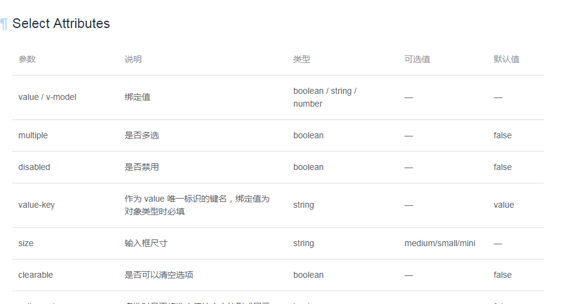

# 框架篇（vue、angular）
---

::: tip 提示
基本原则：遵循前端工厂化开发模式，组件化、模块化、抽象化
:::

1. 组件声明须用语义化的英文来命名（驼峰命名法）
2. 路由嵌套不能多于三层
3. 接口须统一在单独的`js`文件内封装注册，外部域名须统一封装处理
4. `vue-store`，`ng-store`需根据项目大小决定引入与否，（建议较大项目引	 入），小项目或单个页面采用传值即可
5. 异步函数采用`async` `await`的实现方式来代替`promise`
6. 统一推荐使用箭头函数，展示式运算符
7. 字符串拼接必须使用`${}`，`html`拼接必须使用反引号``简化操作
8. `default`函数参数设置默认值，单独的`js`文件须有`export`
9. 组件的封装要尽量降低与其他组件的耦合性
10. 所有的组件必须按照一个固定的结构，导出一个清晰、组织有序的组件，使得代码易于阅读和理解。同时也便于标准化`（name,data,props,components,filters,mounted,watch,methods）`
11. 谨慎使用`$refs`，`$parent`等查找元素的方法（组件必须是独立的，如果一个组件的API不能够提供所需要的功能，那么这个组件在设计、实现上是有问题的）
12. 推荐安装vue devtools进行调试开发
13. 建议提供组件API文档，类似如下的效果，可以更新在REDME.md文件中	（效果如下）

14. 必须使用class语法，避免直接操作prototype属性

