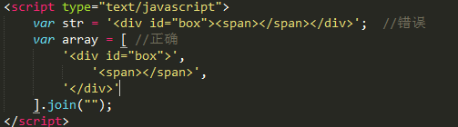
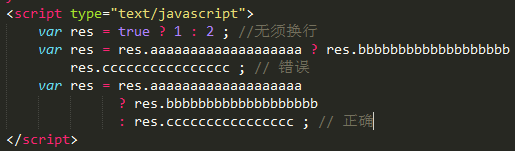
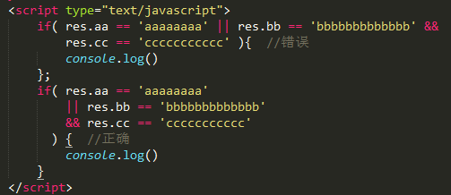
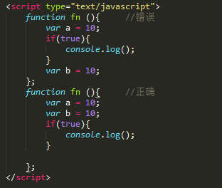
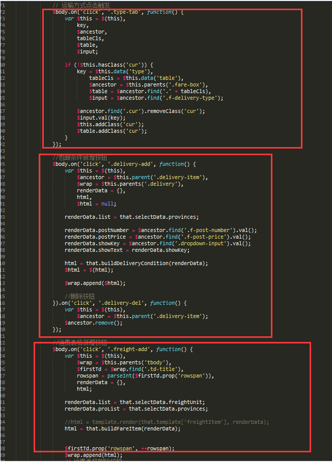
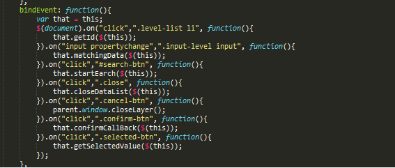
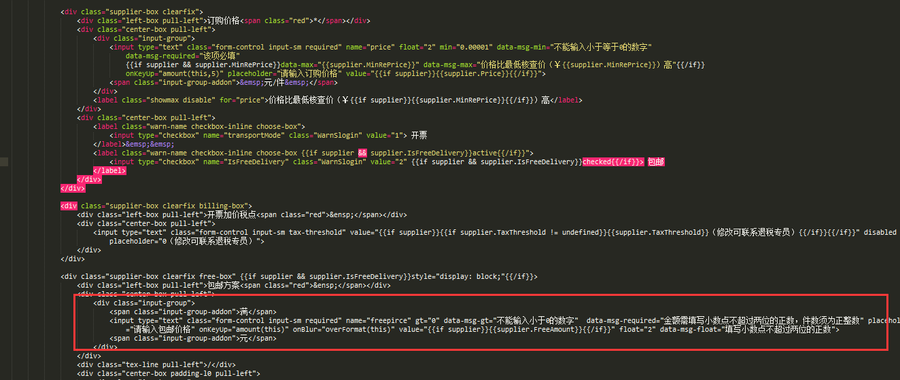

# JS篇
---

::: tip 提示
基本原则：提高代码本身的清晰性、可读性，合理的注释、空行排版使代码更易读（优先推荐使用ES6语法,TypeScript语法）
:::

1. 单独的`js`文件须有文件注释，文件注释用于告诉不熟悉这段代码的读者这个文件中包含哪些东西。应该提供文件的大体内容，它的作者，依赖关系和兼容性信息。如下:
```
/**
  * fileovervier Description of file, its uses and information
  * about its dependencies.
  * author usergmeizu.com (Firstname Lastname)
  * Copyright 2809 meizu Inc, All Rights Reserved.
  */
```
2. 命名规范，变量声明需提前，`vue`，`angular`须采用es6规范（`let` `const`），全局变量须大写，局部变量采用驼峰命名法
3. 条件判断必须使用`===`符号，优先推荐三元，`switch`代替`if`
4. 数组遍历禁止使用`for in`，推荐使用`for of`，`map()`，`reduce()`
5. 函数在接入异步过来的参数必须加入类型和非空判断
6. 不要在一个非函数代码块（`if，else，while`）中声明函数，建议作为变量接入
7. `js`中拼接`html`要结构清晰，为了方便后续的维护,可根据场情使用数组	 或我们目前统一的模板插件`art-template`，一定杜绝以下拼接方式：


8. 如果写公用jquery组件，组件一般都是独立不需要依赖过多的其它插件，为了代码的可读性，必须使用数组的方式。如下



9. 三元运算符过长



10. 过长的逻辑组合



11. 函数内声名变量的方式，因js存在变量提升，所以声名变量时应在方法内	 最上面只使用一个var 把当前方法内所用的变量提前声名好。



12. `jquery`项目，目前我们只针对js进行了分模块处理，使用`gulp+browserify`打包，为了便于阅读和后期的开发维护，我们目前规定，每个`js`文件中的代码最好不超过五百行。假设`demo`中的`index.html`对应的`index.js`逻辑较于复杂，我们需要拆分多个功能代码块。首先我们先建一个和`index.js`同名的文件夹，假如我们需要把添加和编辑抽出两个独立的代码模块，那么在`index`文件夹中就会有：`add.js` 处理添加功能，`edit.js`处理编辑功能。这样拆分后，主入口的`index.js`只负责统一绑定事件并调用当前事件处理业务逻辑的方法，统一缓存`jquer`y对像，还可以处理一些简单的业务逻辑，个人视情况而定。如果针对这个项目的一些公用方法可以在pages中建一个`common.js`，同样用`import`引用既可。
13. 只能在一个方法中做绑定事件并且绑定事件方法中不要写业务逻辑，一个事件调用一个方法。业务逻辑可以写在绑定事件调用的方法中。
以下为错误：



以下正确：



14. html如果标签自定义属性过多，可以换行。在使用模板时，html加上封闭符。
以下代码纯白色，没色彩区分，是html中没加封闭符导致的。


