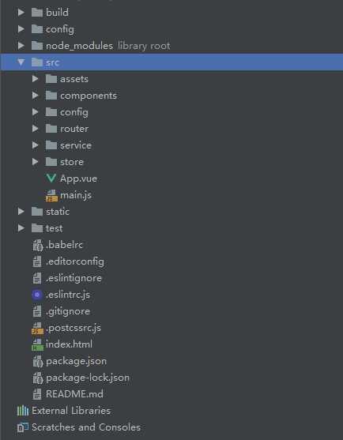

# 目录结构
---
## 项目固定目录结构：
- build webpack打包配置文件
- config webpack配置区分环境配置文件
- src 项目主要目录
    - assets 用于存放组件公用的css、img文件
    - components 用于存放业务组件
    - config 存放公共配置，如接口的封装，公共方法等
    - router 用于存放路由
    - service 所有api统一存放于此处
    - store 用于存放全局状态管理
    - APP.vue 用于引入其他组件的根组件
    - man.js 项目入口文件
- static 静态资源文件

## 项目固定结构的图解：

