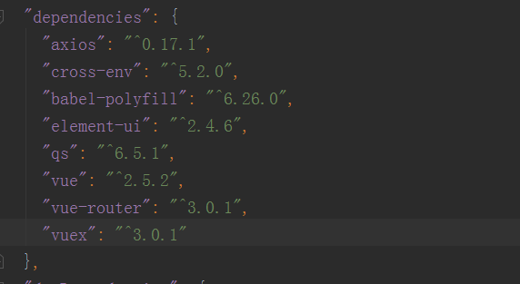
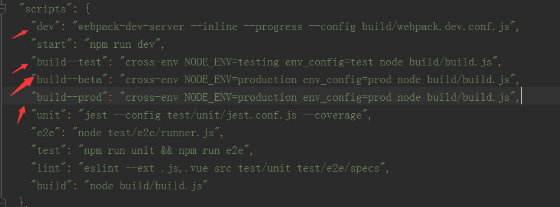

# 项目依赖

## 必要依赖
1. Axios： http请求库，用于封装接口，请求api
2. Cross-env： 用于判断生产环境执行不同的打包命令
3. Babel-polyfill： es6、es7语法降阶转为es5语法
4. Element-ui： vue官方推荐css组件库
5. Qs： 接口封装时用于json数据转换
6. Vue： 项目的基础
7. Vue-router： 项目路由基于此依赖开展
8. Vuex： 用于存储全局变量
### 图解

## script命令
1. npm run dev 启动本地服务
2. npm run build--test 测试服打包
3. npm run build--beta beta环境打包
4. npm run build--prod 正式服打包

### 图解

